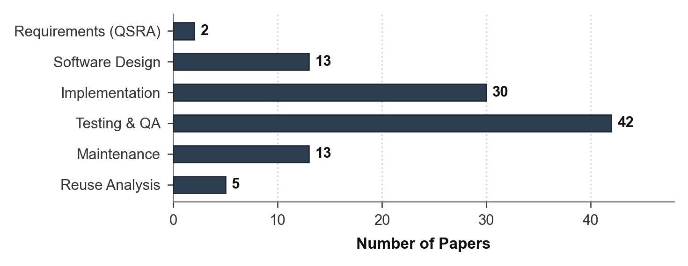
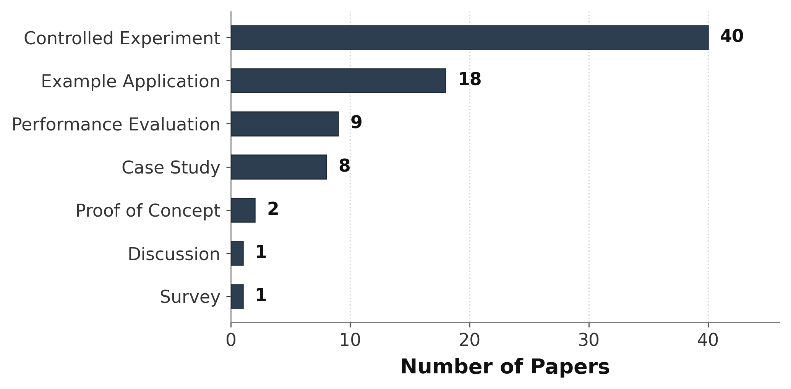
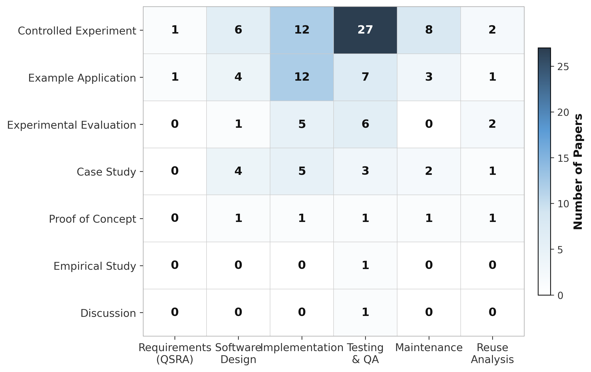
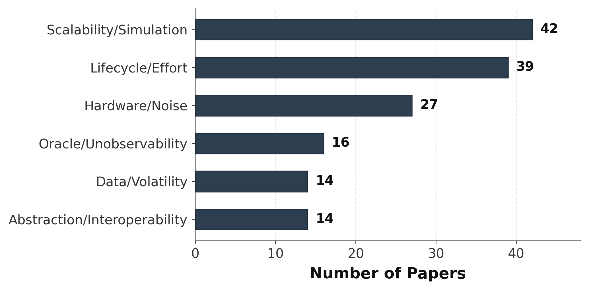
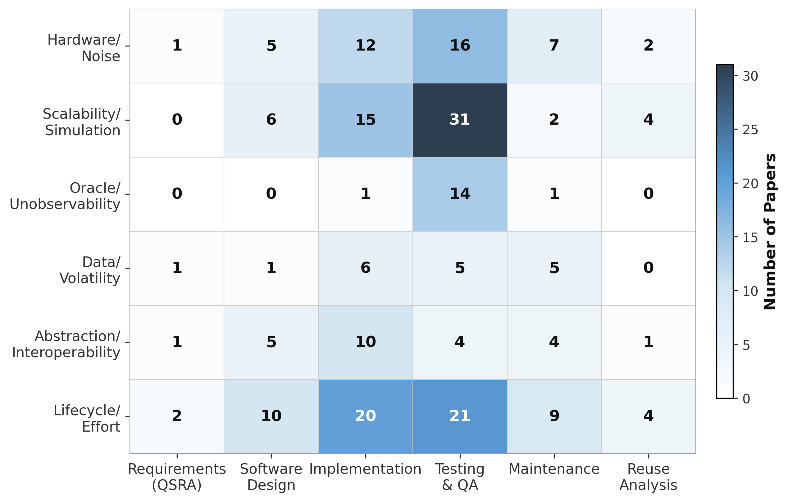

# Software Engineering Tools for Quantum Computing: A Literature Review

> **Companion repository** for the paper *"Software Engineering Tools for Quantum Computing: A Literature Review"*, submitted to **WQSE 2026 - Workshop on Quantum Software Engineering** (September 8–12, São Paulo, SP, Brazil).

---

## 📖 Overview

Quantum Computing (QC) is rapidly evolving from a theoretical paradigm into a practical computing platform, increasing the demand for Software Engineering (SE) tools to support the development of reliable and maintainable quantum software. Although numerous SE tools have recently been proposed, the current landscape remains fragmented and lacks a comprehensive synthesis.

This literature review identifies, catalogs, and characterizes tools designed to support Software Engineering activities in the development of quantum software systems. Following established guidelines, **4,489 publications** were assessed and **71 primary studies** were selected after applying predefined inclusion and exclusion criteria.

---

## 🔬 Research Questions

This study is guided by three research questions:

| # | Research Question | Focus |
|---|-------------------|-------|
| **RQ1** | What categories of SE tools have been proposed for Quantum Computing, and which phases of the QSDL do they support? | Tool categories & lifecycle coverage |
| **RQ2** | What types of empirical evidence have been used to evaluate these tools? | Empirical validation methods |
| **RQ3** | What limitations, challenges, and research gaps have been reported in the existing literature? | Challenges & future directions |

---

## 📋 Methodology

The review protocol combines the construction of an initial study set (**Start Set**) with an iterative **snowballing** strategy, following the guidelines proposed by Wohlin (2014) and Keele et al. (2007).

📄 **[Full methodology diagram (PDF)](images/metodologia%20(2).pdf)**

### Start Set Construction

The Start Set was established through manual inspection of papers published in the **Workshop on Quantum Software Engineering (Q-SE @ ICSE)** on [DBLP](https://dblp.org/db/conf/icse-qse/index.html). Titles, abstracts, and keywords were analyzed to identify studies proposing, evaluating, or discussing SE tools for quantum applications.

### Study Selection Criteria

**Inclusion criterion:**
- **IC1:** The study presents, proposes, evaluates, or discusses a SE tool or framework for Quantum Computing.

**Exclusion criteria (EC1–EC11):** studies not in English, studies merely using existing tools, tutorials/posters, duplicates, studies without architectural description, inaccessible studies, non-peer-reviewed, unrelated to QSE tools, purely theoretical, secondary studies, or studies with unrelated primary contributions.

---

## 📊 Key Findings

### RQ1 — Tool Categories & QSDL Phases

Eight major categories of SE tools were identified:

1. **Requirements and Modeling Tools**
2. **Code Generation and Model-Driven Engineering Tools**
3. **Programming Assistants and AI-based Coding Tools**
4. **Static Analysis and Quality Assurance Tools**
5. **Testing Frameworks**
6. **Runtime Verification and Assertion Frameworks**
7. **Debugging and Program Understanding Tools**
8. **Execution, Middleware, and Maintenance Tools**

The tools were mapped to the **Quantum Software Development Lifecycle (QSDL)** proposed by Dwivedi et al. (2024), which comprises six phases:

<p align="center">
  
</p>

> **Testing & QA** (42 papers) and **Implementation** (30 papers) dominate the landscape, while **Requirements** (2) and **Reuse Analysis** (5) remain significantly underexplored.

### RQ2 — Empirical Evidence

<p align="center">
  
</p>

**Controlled Experiments** (40 studies) represent the dominant evaluation strategy, followed by **Example Applications** (18). Industrial case studies and practitioner-oriented evaluations remain scarce, highlighting an important gap for future research.

### Evidence × QSDL Phase Heatmap

<p align="center">
  
</p>

> The **Controlled Experiment × Testing & QA** combination (27 papers) is the most frequent, reinforcing the community's focus on quantum software testing. Requirements, Maintenance, and Reuse exhibit substantially fewer empirical evaluations regardless of the method adopted.

### RQ3 — Challenges & Research Gaps

<p align="center">
  
</p>

The main challenges identified include:

- **Hardware/Noise** — NISQ limitations, noise, decoherence, gate errors, and physical connectivity constraints
- **Scalability/Simulation** — exponential cost of classical simulation, memory overflow, and strict qubit limits
- **Oracle/Unobservability** — no-cloning theorem, quantum state collapse, lack of ground truth, and probabilistic evaluation
- **Data/Volatility** — scarcity of datasets/real bugs, rapid API changes, and tool obsolescence
- **Abstraction/Interoperability** — low-level gate programming, strong framework dependency, and lack of modularity
- **Lifecycle/Effort** — gaps in requirements/maintenance support, high manual effort, and steep learning curves

### Limitations × QSDL Phase Heatmap

<p align="center">
  
</p>

> The intersection between these limitations and the QSDL phases provides insights into where the challenges are most acutely felt during the development lifecycle.

---

## 🗂️ Repository Structure

```
.
├── phase_distribution_chart.py          # QSDL phase distribution chart (Figure 1)
├── evidence_graph.py                    # Empirical evidence distribution chart (Figure 2)
├── evidence_phase_heatmap.py            # Evidence × Phase heatmap (Figure 3)
├── limitations_graph.py                 # Limitations distribution chart (Figure 4)
├── limitations_phase_chart.py           # Limitations × Phase heatmap (Figure 5)
├── resources/
│   ├── Artigos aceitos (...).csv/pdf    # Data extraction form responses
│   └── articles_all.xls                 # Full dataset of selected studies
├── images/                              # Generated figures
│   ├── compact_graph.png
│   ├── compact_evidence_graph.png
│   ├── evidence_vs_phase_heatmap.png
│   ├── limitations_graph.png
│   └── limitations_vs_phase_heatmap.png
└── README.md
```

### Script Descriptions

| Script | Description | Generates |
|--------|-------------|-----------|
| `phase_distribution_chart.py` | Parses the data extraction form and plots the distribution of selected studies across QSDL phases. | Figure 1 in the paper |
| `evidence_graph.py` | Extracts and plots the distribution of empirical evidence types used to evaluate the identified tools. | Figure 2 in the paper |
| `evidence_phase_heatmap.py` | Cross-tabulates empirical evidence types with QSDL phases to produce a heatmap visualization. | Figure 3 in the paper |
| `limitations_graph.py` | Extracts and plots the frequency of reported limitations and challenges. | Figure 4 in the paper |
| `limitations_phase_chart.py` | Cross-tabulates limitations with QSDL phases to produce a heatmap visualization. | Figure 5 in the paper |

---

## ⚙️ Reproducing the Figures

### Prerequisites

- Python 3.10+
- Required libraries: `pypdf`, `matplotlib`, `numpy`

```bash
pip install pypdf matplotlib numpy
```

### Generating the Charts

```bash
# Figure 1 — Distribution by QSDL phase
python phase_distribution_chart.py

# Figure 2 — Distribution by empirical evidence type
python evidence_graph.py

# Figure 3 — Evidence × Phase heatmap
python evidence_phase_heatmap.py

# Figure 4 — Distribution of limitations
python limitations_graph.py

# Figure 5 — Limitations × Phase heatmap
python limitations_phase_chart.py
```

All figures are saved in both **PNG** (300 dpi) and **PDF** formats in the `images/` directory.

---

## 🏷️ QSDL Phase Definitions

Based on the Quantum Software Development Lifecycle (QSDL) by Dwivedi et al. (2024):

| Phase | Description |
|-------|-------------|
| **Requirements (QSRA)** | Specification and conceptual modeling of quantum and hybrid systems |
| **Software Design** | Architectural design of quantum software |
| **Implementation** | Coding, circuit construction, and code generation |
| **Testing & QA** | Testing, verification, debugging, static analysis, and quality assurance |
| **Maintenance** | Software evolution, modernization, and configuration management |
| **Reuse Analysis** | Component reuse and pattern identification in quantum software |

---

## 📄 License

This project is for academic use. Data, scripts, and extracted datasets are provided for research reproducibility purposes.